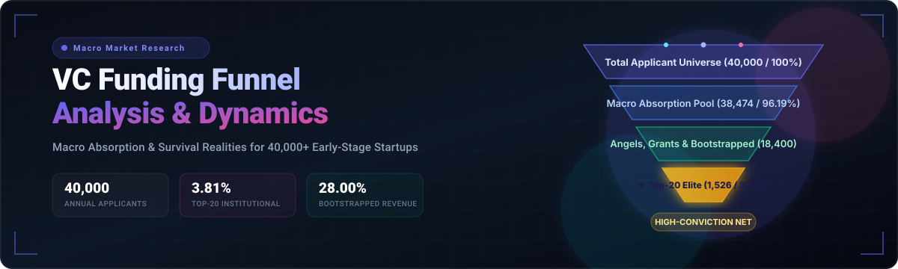

<div align="center">
  
  <br /><br />
  <a href="https://github.com/ishandutta2007/Awesome-Awesome-Awesome"></a>
  <a href="https://discord.gg/jc4xtF58Ve"></a>
  <a href="https://github.com/ishandutta2007/Venture-Capital-Funding-Funnel-Analysis/stargazers"></a>
  <a href="https://github.com/ishandutta2007/Venture-Capital-Funding-Funnel-Analysis/network/members"></a>
  <a href="https://github.com/ishandutta2007/Venture-Capital-Funding-Funnel-Analysis/blob/main/LICENSE"></a>
  <a href="https://github.com/ishandutta2007"></a>
</div>

# 🚀 Early-Stage Venture Capital Funding Funnel Analysis (Sub-$1M) 📉

## 📌 Overview & Methodology
This document establishes the absolute mathematical reality of the early-stage tech startup fundraising market. To understand where rejected founders end up, we isolate a global universe of **40,000 unique early-stage applications per cycle** (reflecting Y Combinator's typical annual volume across its multi-batch setup) 🌐.

To resolve the "overlap problem" (where a single premium startup receives multiple offers from different funds), we apply a **High-Conviction Overlap Factor** 🎯. This factor filters out the multi-offer winners who choose Y Combinator or other top tier-1 entities, leaving only the net unique, non-overlapping startups absorbed by each fund.

---

## 📊 Phase 1: The Elite Early-Stage Institutional Capacity (Top 4%) 🏛️

The table below maps out the true statistical distribution for YC alongside the top 20 micro-VCs and elite pre-seed accelerators globally that write sub-$1M checks.

| Investor / Accelerator Tier | Standard Check Size | Raw Stated Acceptance Rate | Estimated Startups Accepted Per Year | Overlap Factor (Startups also accepted by YC / Tier-1s) | Net Unique Companies Funded | % of Initial 40,000 Pool Absorbed |
| :--- | :--- | :--- | :--- | :--- | :--- | :--- |
| **🥇 Y Combinator (YC)** | $500K | **1.0%** | 400 | 0% (Baseline Anchor) | 400 | **1.00%** |
| **Neo** | $600K | ~1.0% | 40 | 60% overlap | 16 | **0.04%** |
| **HF0 Residency** | $500K–$1M | ~1.0% | 30 | 50% overlap | 15 | **0.03%** |
| **South Park Commons** | $400K | ~1.5% | 60 | 45% overlap | 33 | **0.08%** |
| **a16z Speedrun** | $750K–$1M | <1.0% | 120 | 40% overlap | 72 | **0.18%** |
| **PearX (Pear.vc)** | $250K–$500K | ~1.5% | 40 | 40% overlap | 24 | **0.06%** |
| **Techstars (Flagship)** | $220K | ~1.5% | 300 | 30% overlap | 210 | **0.52%** |
| **500 Global (Flagship)** | $150K | ~2.0% | 100 | 25% overlap | 75 | **0.19%** |
| **Entrepreneur First** | $250K | ~2.5% | 150 | 20% overlap | 120 | **0.30%** |
| **Antler** | $200K–$250K | ~3.0% | 400 | 15% overlap | 340 | **0.85%** |
| **Precursor Ventures** | $250K–$500K | ~1.5% | 40 | 35% overlap | 26 | **0.06%** |
| **Boost VC** | $500K | ~2.0% | 50 | 30% overlap | 35 | **0.09%** |
| **Conviction Embed** | $150K | ~1.0% | 20 | 50% overlap | 10 | **0.02%** |
| **AI Grant** | $250K | ~1.5% | 60 | 40% overlap | 36 | **0.09%** |
| **OpenAI Converge** | $1M | <1.0% | 15 | 60% overlap | 6 | **0.01%** |
| **Right Side Capital** | $500K–$1M | ~2.5% | 80 | 10% overlap | 72 | **0.18%** |
| **K9 Ventures** | $250K–$750K | ~1.0% | 10 | 40% overlap | 6 | **0.01%** |
| **Chapter One** | $500K–$1M | ~2.0% | 25 | 35% overlap | 16 | **0.04%** |
| **2048 Ventures** | $500K | ~2.0% | 30 | 30% overlap | 21 | **0.05%** |
| **Afore Capital** | $100K–$500K | ~2.0% | 40 | 30% overlap | 28 | **0.07%** |
| **💼 Total Institutional Capacity** | — | — | **2,020** | — | **1,526** | **3.81%** |

---

## 📊 Phase 2: Macro Absorption of the Remaining 96.19% Pool 🌊

After the top 20 institutional funds lock in their cohorts, **38,474 startups** remain in the application funnel without institutional capital. 

Tracking these remaining companies over a 12-to-24-month horizon yields a realistic distribution of how this remaining pool is absorbed across alternative capital markets, organic operations, or attrition.

| Macro Absorption Track | Target Capital Mechanism | Estimated Startups Absorbed | % of Remaining Pool | % of Original 40,000 Pool | Strategic Characteristics |
| :--- | :--- | :--- | :--- | :--- | :--- |
| **📈 Regional VCs & Secondary Micro-Funds** | Small checks from regional tech hubs, university funds, or tier-3 state-backed programs. | 1,600 | 4.16% | **4.00%** | Highly geographic or localized validation; focus on steady regional multiples rather than hyper-scale. |
| **🌟 Angel Syndicates & High-Net-Worths** | Deal curation via platforms like AngelList, private syndicates, or domain-expert operators. | 4,800 | 12.48% | **12.00%** | Driven by personal alignment, corporate background affinities, or high-conviction specific bets. |
| **💡 Crowdfunding & Non-Dilutive Government Grants** | Crowdfunding structures (Wefunder, Republic) or government innovation structures (SBIR, Horizon Europe). | 2,400 | 6.24% | **6.00%** | Community-backed equity or non-dilutive R&D injections; trades institutional validation for raw customer buy-in. |
| **🚀 Bootstrapping & Customer-Revenue Survival** | Customer-funded development, zero equity sales, conversion to lifestyle or agency business models. | 11,200 | 29.11% | **28.00%** | Prioritizes fast path to unit profitability over speed of customer acquisition; yields sustainable, durable cash flow. |
| **⚠️ Dormancy, Soft Failure, & Rapid Attrition** | Team breakups, failure to clear product-market validation, inability to fund baseline engineering costs. | 18,474 | 48.01% | **46.19%** | Fast wind-down within 12 months; founders return to enterprise employment or immediately pivot to new entities. |
| **💼 Total Remaining Pool** | — | **38,474** | **100.00%** | **96.19%** | — |

---

## 📊 Final Unified Market Distribution (The 100% Macro Matrix) 🗺️

Putting it all together, this is the definitive roadmap for the global startup application pipeline:

```
[40,000 Total Applicants]
  │
  ├── 3.81%  ➡️ Institutional Top 20 Elite Funds (1,526)
  │
  └── 96.19% ➡️ The Rest of the Market Pool (38,474)
        │
        ├── 4.00%  ➡️ Regional & Secondary Micro VCs (1,600)
        ├── 12.00% ➡️ Angel Syndicates & Private HNWs (4,800)
        ├── 6.00%  ➡️ Grants & Retail Equity Crowdfunding (2,400)
        ├── 28.00% ➡️ Sustainable Bootstrapped Entities (11,200)
        └── 46.19% ➡️ Attrition / Immediate Wind-downs (18,474)
```

## 🛠 Strategic Mindset for Founders Outside the Top 4% 💡

1. 👼 **The Angel Premium:** Angel investors and private syndicates absorb three times as many startups as the top 20 institutional micro-funds combined (12% vs 3.81%). Bypassing the standardized portal funnel in favor of highly tailored, relational cold networks is statistically more viable.
2. 💰 **Bootstrapping Is the True Baseline:** 28% of the ecosystem turns into revenue-generating, self-sustaining businesses. For many B2B SaaS or transactional tech models, this customer-first validation acts as a stronger long-term signal than a pre-seed institutional stamp.
3. ⏳ **The Attrition Gravity:** Close to half (46.19%) of all ideas submitted to early-stage platforms dissolve quickly. If a company can survive past month 12 through sheer operational velocity—even without institutional backing—it automatically steps into the upper half of global startup longevity metrics.

---

## ⭐ Star History

[](https://star-history.dera.page/#ishandutta2007/Venture-Capital-Funding-Funnel-Analysis&type=date&legend=top-left)
